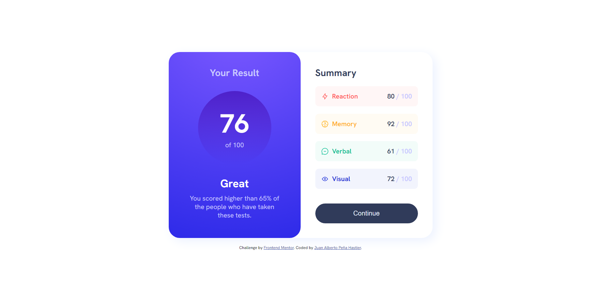
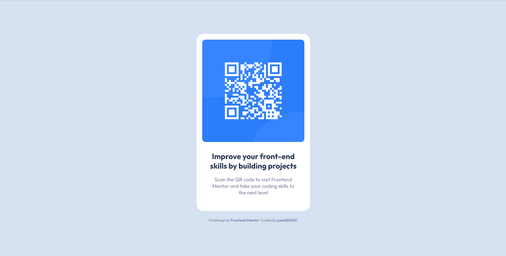

# Frontend Mentor - Results challenges on Frontend Mentor

These are solutions to the [challenges on Frontend Mentor](https://www.frontendmentor.io/challenges). Frontend Mentor challenges help you improve your coding skills by building realistic projects. 

## Table of contents

- [Challenges](#challenges)
  - [Product preview card component](#product-preview-card-component)
    - [Screenshot Product preview card component](#screenshot-product-preview-card-component)
    - [Links Product preview card component](#links-product-preview-card-component)
  - [Results summary component](#results-summary-component)
    - [Screenshot Results summary component](#screenshot-results-summary-component)
    - [Links Results summary component](#links-results-summary-component)
  - [Interactive rating component](#interactive-rating-component)
    - [Screenshot Interactive rating component](#screenshot-interactive-rating-component)
    - [Links Interactive rating component](#links-interactive-rating-component)
  - [QR code component](#qr-code-component)
    - [Screenshot QR code component](#screenshot-qr-code-component)
    - [Links QR code component](#links-qr-code-component)
- [Useful resources](#useful-resources)
- [Author](#author)
- [Acknowledgments](#acknowledgments)

## Challenges

### Product preview card component

#### Screenshot Product preview card component

#### Links Product preview card component

- Solution URL: [Product preview card component](https://github.com/juan880630/frontend-mentor-challenges/tree/main/product-preview-card-component-main)
- Live Site URL: [Product preview card component](https://juan880630.github.io/frontend-mentor-challenges/product-preview-card-component-main)

### Results summary component

#### Screenshot Results summary component

#### Links Results summary component

- Solution URL: [Results summary component](https://github.com/juan880630/frontend-mentor-challenges/tree/main/results-summary-component-main)
- Live Site URL: [Results summary component](https://juan880630.github.io/frontend-mentor-challenges/results-summary-component-main/)

### Interactive rating component

#### Screenshot Interactive rating component

#### Links Interactive rating component

- Solution URL: [Interactive rating component](https://github.com/juan880630/frontend-mentor-challenges/tree/main/interactive-rating-component-main)
- Live Site URL: [Interactive rating component](https://juan880630.github.io/frontend-mentor-challenges/interactive-rating-component-main/)

### QR code component

#### Screenshot QR code component

#### Links QR code component

- Solution URL: [QR code component](https://github.com/juan880630/frontend-mentor-challenges/tree/main/qr-code-component-main)
- Live Site URL: [QR code component](https://juan880630.github.io/frontend-mentor-challenges/qr-code-component-main/)

## Useful resources

- [MDN](https://developer.mozilla.org/) - This is an amazing web site which helped me finally understand every thing about web. I'd recommend it to anyone still learning.
- [Sass](https://sass-lang.com) - This is the official Sass site, where I have learned about this wonderful css preprocessor.

## Author

- Frontend Mentor - [@juan880630](https://www.frontendmentor.io/profile/juan880630)

## Acknowledgments

Many thanks to the MDN and SASS teams
