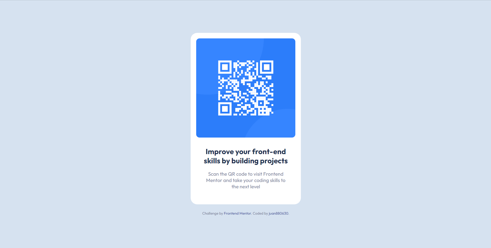

# Frontend Mentor - QR code component solution

This is a solution to the [QR code component challenge on Frontend Mentor](https://www.frontendmentor.io/challenges/qr-code-component-iux_sIO_H). Frontend Mentor challenges help you improve your coding skills by building realistic projects. 

## Table of contents

- [Overview](#overview)
  - [Screenshot](#screenshot)
  - [Links](#links)
- [My process](#my-process)
  - [Built with](#built-with)
  - [What I learned](#what-i-learned)
  - [Continued development](#continued-development)
  - [Useful resources](#useful-resources)
- [Author](#author)
- [Acknowledgments](#acknowledgments)

## Overview

### Screenshot



### Links

- Solution URL: [QR code component](https://github.com/juan880630/frontend-mentor-challenges/tree/main/qr-code-component-main)
- Live Site URL: [QR code component](https://juan880630.github.io/frontend-mentor-challenges/qr-code-component-main/)

## My process

### Built with

- Semantic HTML5 markup
- CSS custom properties
- Flexbox
- Mobile-first workflow
- Sass

### What I learned

- While working on this project I learned the basics of Sass; like the use of sass:math and how styles are nested, and so on.

See below:

```scss
@use "sass:math"; 

.card {
  max-width: 335px;
  padding: $base-padding * 1.5;
  border-radius: $base-border-radius;
  box-shadow: $base-box-shadow;
  background-color: $otro-mas;

  .card-header {
      .card-img {
          display: block;
          border-radius: math.div($base-border-radius, 2);
      }
  }

  ...
}
```

### Continued development

I would like to focus my efforts on future projects in areas such as semantic HTML5 markup and continue learning Sass.

### Useful resources

- [MDN](https://developer.mozilla.org/) - This is an amazing web site which helped me finally understand every thing about web. I'd recommend it to anyone still learning.
- [Sass](https://sass-lang.com) - This is the official Sass site, where I have learned about this wonderful css preprocessor.

## Author

- Frontend Mentor - [@juan880630](https://www.frontendmentor.io/profile/juan880630)

## Acknowledgments

Many thanks to the MDN and SASS teams
