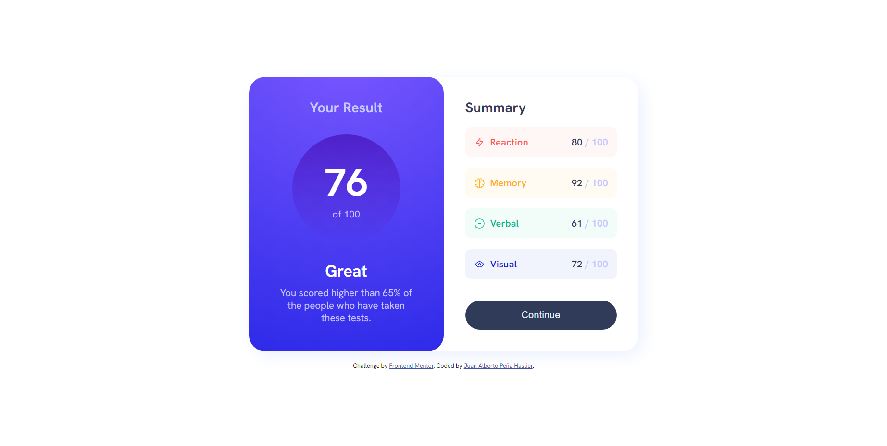

# Frontend Mentor - Results summary component solution

This is a solution to the [Results summary component challenge on Frontend Mentor](https://www.frontendmentor.io/challenges/results-summary-component-CE_K6s0maV). Frontend Mentor challenges help you improve your coding skills by building realistic projects. 

## Table of contents

- [Overview](#overview)
  - [The challenge](#the-challenge)
  - [Screenshot](#screenshot)
  - [Links](#links)
- [My process](#my-process)
  - [Built with](#built-with)
  - [Continued development](#continued-development)
  - [Useful resources](#useful-resources)
- [Author](#author)
- [Acknowledgments](#acknowledgments)

## Overview

### The challenge

Users should be able to:

- View the optimal layout for the interface depending on their device's screen size
- See hover and focus states for all interactive elements on the page

### Screenshot

### Links

- Solution URL: [Results summary component](https://github.com/juan880630/frontend-mentor-challenges/tree/main/results-summary-component-main)
- Live Site URL: [Results summary component](https://juan880630.github.io/frontend-mentor-challenges/results-summary-component-main/)

## My process

### Built with

- Semantic HTML5 markup
- CSS custom properties
- Flexbox
- Mobile-first workflow
- Vanilla javascript

### Continued development

- Semantic HTML5 markup

### Useful resources

- [MDN](https://developer.mozilla.org/) - This is an amazing web site which helped me finally understand every thing about web. I'd recommend it to anyone still learning.

## Author

- Frontend Mentor - [@juan880630](https://www.frontendmentor.io/profile/juan880630)

## Acknowledgments

- Many thanks to the MDN team